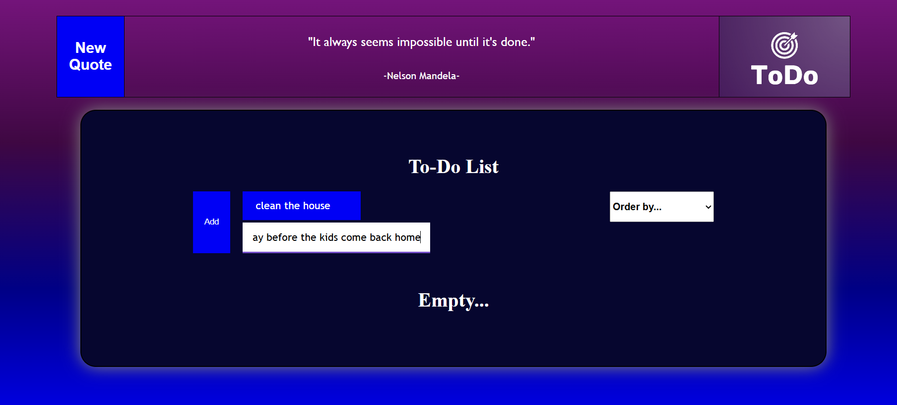
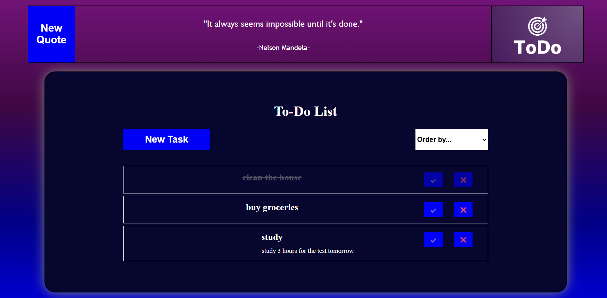
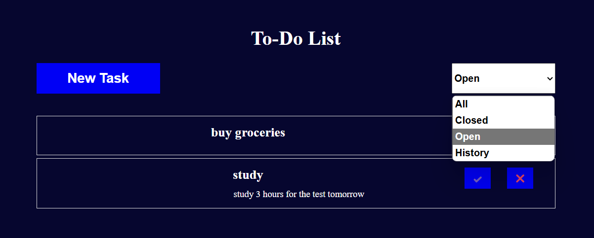

To-Do List App

Overview

This is a simple To-Do List application built with React, Vite, and TypeScript. The app allows users to add, complete, delete tasks, and filter tasks based on their completion status. Additionally, deleted tasks are stored in a history section. The app also fetches and displays a random quote using the site qapi.vercel.app Quotes API.

Features

• Add new tasks with a description

• Mark tasks as complete or incomplete

• Delete tasks (moves them to history)

• Filter tasks by status: All, Open, Close, History

• Fetches a motivational quote

• Tasks and history are stored in Local Storage

• Smooth UI transitions when adding tasks

Technologies Used

• React

• Vite

• TypeScript

• Local Storage

• site qapi.vercel.app Quotes API

Usage

1. Click the "New Task" button to add a new task.

2. Enter a task name and description, then click "Add".

3. Click on a task to mark it as complete or incomplete.

4. Click the task subject to toggle the task description.

5. Click ❌ to delete a task (it moves to history).

6. Use the dropdown to filter tasks by All, Open, Close, or History.

API Integration

This app fetches a random motivational quote using the site qapi.vercel.app Quotes API.
No need of an API key.

License

This project is open-source and available for modification and use.

Screenshots

